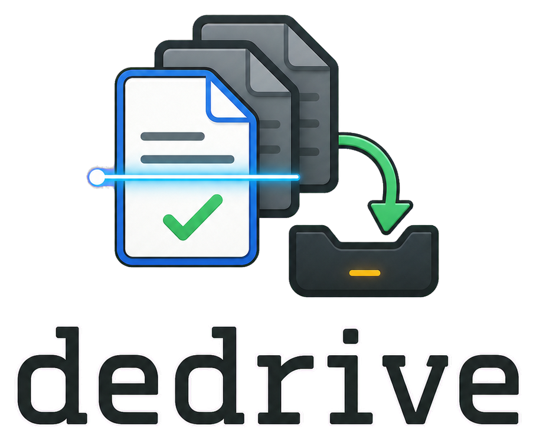
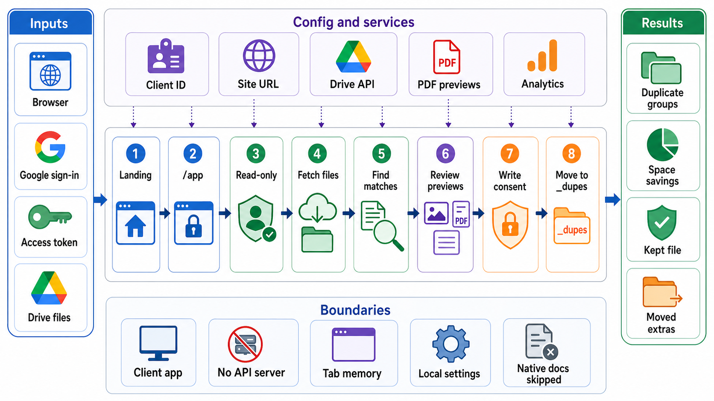

<div align="center">
  

  **🔍 Find duplicate files in Google Drive with a private, read-only-first cleanup flow 🧹**

  [Live Demo](https://dedrive.tsilva.eu)
</div>

dedrive is a browser-based Google Drive duplicate finder built with Next.js. It scans your own Drive files, groups exact matches by checksum, and lets you review duplicates before making any changes.

The cleanup flow starts with read-only Drive access. If you choose to proceed, dedrive asks for write access only before moving unchosen copies into a `_dupes` folder.

## Install

```bash
git clone https://github.com/tsilva/dedrive.git
cd dedrive
./setup.sh
pnpm dev
```

Open [http://localhost:3000](http://localhost:3000), then use `/app` for the secure Drive workflow.

If you configure Google Cloud manually instead of running `./setup.sh`, create `.env.local` with:

```bash
NEXT_PUBLIC_GOOGLE_CLIENT_ID=your-client-id.apps.googleusercontent.com
NEXT_PUBLIC_SITE_URL=https://dedrive.tsilva.eu
```

## Commands

```bash
./setup.sh    # configure Google Cloud OAuth, write .env.local, install deps
pnpm dev      # start the Next.js dev server
pnpm build    # build for production
pnpm start    # serve the production build
```

## Notes

- Requires Node.js, pnpm, a Google Cloud project, and an OAuth web client with the Google Drive API enabled.
- `NEXT_PUBLIC_GOOGLE_CLIENT_ID` is required. `NEXT_PUBLIC_SITE_URL` is optional and defaults to `https://dedrive.tsilva.eu`.
- Optional marketing-route metadata integrations use `NEXT_PUBLIC_GA_MEASUREMENT_ID`, `GOOGLE_SITE_VERIFICATION`, `BING_SITE_VERIFICATION`, and `YANDEX_SITE_VERIFICATION`; analytics are disabled inside `/app`.
- The privileged workflow runs at `/app`; there are no backend API routes, and the route uses a nonce-based Content Security Policy for scripts.
- Write access is requested only for execution and is revoked after the move flow finishes.
- After execution, the browser can purge app auth data and app-owned local browser storage.
- Scan results and keep decisions stay in the active browser tab. Non-sensitive settings use `localStorage`.
- Google Workspace native files are skipped because they do not expose `md5Checksum`.
- Duplicates are moved into `_dupes`; dedrive ignores files already there on future scans and does not permanently delete files.

## Architecture



## License

[MIT](LICENSE)
