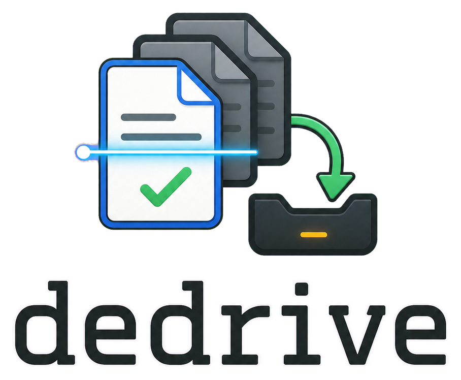
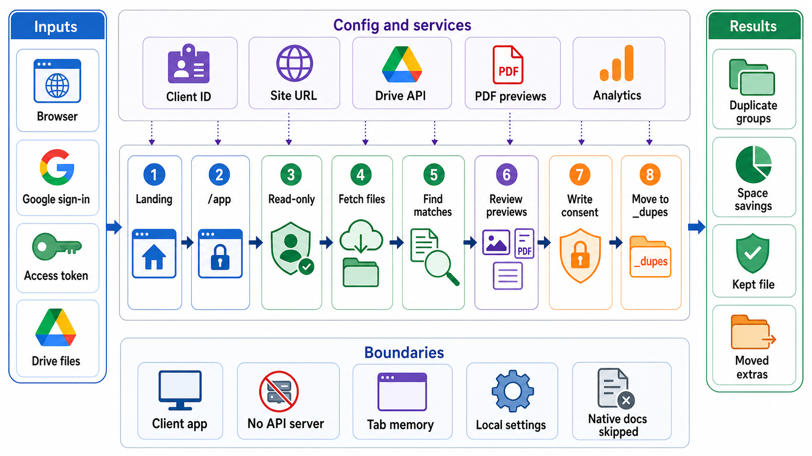

<div align="center">
  

  **🔍 Find duplicate files in Google Drive with a private, read-only-first cleanup flow 🧹**

  [Live Demo](https://dedrive.tsilva.eu)
</div>

dedrive is a browser-based Google Drive duplicate finder built with Next.js. It scans your own Drive files, groups exact matches by checksum, and lets you review each group, mark duplicate copies to discard, or keep everything before making any changes.

The cleanup flow starts with read-only Drive access. If you choose to proceed, dedrive asks for write access only before moving copies you marked as duplicates into a `_dupes` folder.

## Install

```bash
git clone https://github.com/tsilva/dedrive.git
cd dedrive
./setup.sh
pnpm dev
```

Open [http://localhost:3000](http://localhost:3000), then use `/app` for the secure Drive workflow.

If you configure Google Cloud manually instead of running `./setup.sh`, create `.env.local` with:

```bash
NEXT_PUBLIC_GOOGLE_CLIENT_ID=your-client-id.apps.googleusercontent.com
NEXT_PUBLIC_SITE_URL=https://dedrive.tsilva.eu
```

## Commands

```bash
./setup.sh    # configure Google Cloud OAuth, write .env.local, install deps
pnpm dev      # start the Next.js dev server
pnpm test     # run the Vitest regression suite
pnpm build    # build for production
pnpm start    # serve the production build
```

## Notes

- Requires Node.js, pnpm, a Google Cloud project, and an OAuth web client with the Google Drive API enabled.
- `NEXT_PUBLIC_GOOGLE_CLIENT_ID` is required. `NEXT_PUBLIC_SITE_URL` is optional and defaults to `https://dedrive.tsilva.eu`.
- Optional marketing-route metadata integrations use `NEXT_PUBLIC_GA_MEASUREMENT_ID`, `GOOGLE_SITE_VERIFICATION`, `BING_SITE_VERIFICATION`, and `YANDEX_SITE_VERIFICATION`; analytics are disabled inside `/app`.
- The privileged workflow runs at `/app`; there are no backend API routes, and the route uses a nonce-based Content Security Policy for scripts.
- Write access is requested only for execution and is revoked after the move flow finishes.
- Google access tokens stay in memory. Expiry is handled at the active operation boundary: a scan returns to the signed-out account screen, while execution settles already-started moves, cancels unscheduled moves, and reports the partial result.
- After execution, app auth data and app-owned local browser storage are purged automatically before returning to the initial screen.
- Scan results and review decisions stay in the active browser tab. Non-sensitive settings use `localStorage`.
- Google Workspace native files are skipped because they do not expose `md5Checksum`.
- A scan with no duplicates and a review with no files marked to move both return to the signed-in account screen with a no-change notice. Non-auth scan failures return there with a retry message.
- During review, select every copy you want to discard, then move to the next group. At least one copy in each duplicate group must remain; confirmation is blocked if every copy is selected. Groups show four files per page, and number keys 1–4 toggle the visible files while selections persist across pages. Enter/N confirms the current group, S skips, and E moves to execution. PDF previews open fullscreen with previous/next page controls and arrow-key navigation.
- Preview downloads are capped at 10 MB, limited to two concurrent tasks, and cancelled when their page or workflow closes. Oversized files remain available through the Open in Drive link.
- Scans exclude files shared with the user as well as owned files located beneath a non-owned shared folder. Shared-folder metadata is used only to verify ancestry and is never offered for cleanup.
- Duplicates are moved only into a freshly verified, user-owned, unshared `_dupes` destination. If an existing marked or same-named cleanup folder is shared, dedrive leaves it unchanged, creates a private replacement, and reports that choice. Every app-marked cleanup root is ignored on future scans, and files are never permanently deleted. Mirrored folder ancestry is keyed by private Drive app properties and source folder IDs, so exact names—including whitespace and `/` characters—and same-named sibling folders remain distinct.
- Drive retries are reason-aware: rate limits and safe read failures are retried, folder creation uses pre-generated IDs, and ambiguous file moves are reconciled against current parent metadata before retrying.

## Architecture



## License

[MIT](LICENSE)
